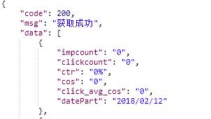

[toc]

# 广告主平台

-------

##0 注意事项
陈亮ip http://192.168.2.111:8890/

|名称|类型|是否必填|说明|
|:---|:---|:---|:---|
|code|INT|YES|200正常，202失败，205登录失效|

# 首页

## 1 首页折线图
请求URL:/Main/action/Report/Report/homeChart
 
 请求方式：POST
 
 请求参数：
 
|名称|类型|是否必填|说明|
|:---|:---|:---|:---|
|date|string|YES|1 今天，2 昨天，3 7天，4 30天，时间段 2018/1/1~ 2018/2/2|
|token|string|YES|登录状态|

返回参数：

|名称|类型|是否必填|说明|
|:---|:---|:---|:---|
|code|INT|YES|返回状态 200正确 202 参数等错误|
|msg|string|YES|说明|
|data|array|YES|array见下|

data数组：

|名称|类型|是否必填|说明|
|:---|:---|:---|:---|
|xAxis|array|YES|时间段|
|series|array|YES|数据|

series数组：

|名称|类型|是否必填|说明|
|:---|:---|:---|:---|
|name|string|YES|曝光数，点击数，点击率，点击均价|
|data|array|YES|数据数组|

## 2. 首页顶部
 请求URL:  /Main/action/Report/Report/topTop
 
 请求方式：POST
 
 请求参数：
 
|名称|类型|是否必填|说明|
|:---|:---|:---|:---|
|token|string|YES|登录状态|

返回参数：

|名称|类型|是否必填|说明|
|:---|:---|:---|:---|
|code|INT|YES|返回状态 200正确 202 参数等错误|
|msg|string|YES|说明|
|data|array|YES|array见下|

data数组：

|名称|类型|是否必填|说明|
|:---|:---|:---|:---|
|balance|string|YES|余额|
|virtual_balance|string|YES|虚拟余额|
|cos|string|YES|总花费用|
|num|string|YES|当前投放广告数|

# 计划

## 3. 保存计划（新增+修改）
 请求URL:/Main/action/Campaign/Campaign/saveCampaign
 
 请求方式：POST
 
 请求参数：
 
|名称|类型|是否必填|说明|
|:---|:---|:---|:---|
|id|INT|NO|修改时传入|
|name|string|YES|计划名称|
|budget|float|YES|预算|
|consumption_rate|INT|YES|投放速度 1标准2加速|
|token|string|YES|登录状态|

返回参数：

|名称|类型|是否必填|说明|
|:---|:---|:---|:---|
|code|INT|YES|返回状态 200正确 202 参数等错误|
|msg|string|YES|说明|
|data|array|YES|array见下|

data数组：

|名称|类型|是否必填|说明|
|:---|:---|:---|:---|
|id|INT|YES|计划ID|

## 4.选择已有计划 列表
请求URL:  /Main/action/Campaign/Campaign/getCampaignNameList
 
 请求方式：POST
 
 请求参数：
 
|名称|类型|是否必填|说明|
|:---|:---|:---|:---|
|token|string|YES|登录状态|

返回参数：

|名称|类型|是否必填|说明|
|:---|:---|:---|:---|
|code|INT|YES|返回状态 200正确 202 参数等错误|
|msg|string|YES|说明|
|data|array|YES|array见下|

data数组：

|名称|类型|是否必填|说明|
|:---|:---|:---|:---|
|id|INT|YES|计划ID|
|name|INT|YES|名称|
|budget|string|YES|预算|
|consumption_rate|INT|YES|消耗速度1标准2加速|

## 5.新增+修改小程序id
请求URL:  /Main/action/App/App/saveApp
 
 请求方式：POST
 
 请求参数：
 
|名称|类型|是否必填|说明|
|:---|:---|:---|:---|
|id|INT|NO|id,修改的时候传入|
|app_id|string|YES|小程序id|
|bind_app_id|string|YES|获取的系统小程序id|
|name|string|YES|名称|
|token|string|YES|登录状态|

返回参数：

|名称|类型|是否必填|说明|
|:---|:---|:---|:---|
|code|INT|YES|返回状态 200正确 202 参数等错误|
|msg|string|YES|说明|
|data|array|YES||

## 6.获取单个小程序id信息
请求URL:  Main/action/App/App/getAppInfo
 
 请求方式：POST
 
 请求参数：
 
|名称|类型|是否必填|说明|
|:---|:---|:---|:---|
|id|INT|YES|修改的时候传入|
|token|string|YES|登录状态|

返回参数：

|名称|类型|是否必填|说明|
|:---|:---|:---|:---|
|code|INT|YES|返回状态 200正确 202 参数等错误|
|msg|string|YES|说明|
|data|array|YES|array见下|

data数组：

|名称|类型|是否必填|说明|
|:---|:---|:---|:---|
|id|INT|YES|id|
|name|string|YES|名称|
|app_id|string|YES|小程序id|

## 7.删除小程序id
请求URL:  /Main/action/App/App/delAppId
 
 请求方式：POST
 
 请求参数：
 
|名称|类型|是否必填|说明|
|:---|:---|:---|:---|
|id|INT|YES|id|
|token|string|YES|登录状态|

返回参数：

|名称|类型|是否必填|说明|
|:---|:---|:---|:---|
|code|INT|YES|返回状态 200正确 202 参数等错误|
|msg|string|YES|说明|
|data|array|YES||

## 8.获取小程序id列表_小程序管理模块
请求URL:  /Main/action/App/App/getAppList
 
 请求方式：POST
 
 请求参数：
 
|名称|类型|是否必填|说明|
|:---|:---|:---|:---|
|page|INT|YES|页数，默认1|
|size|INT|YES|每页数量，默认20|
|token|string|YES|登录状态|

返回参数：

|名称|类型|是否必填|说明|
|:---|:---|:---|:---|
|code|INT|YES|返回状态 200正确 202 参数等错误|
|msg|string|YES|说明|
|data|array|YES|array见下|

data数组：

|名称|类型|是否必填|说明|
|:---|:---|:---|:---|
|row|array|YES|列表|
|count|INT|YES|数量|

row数组：

|名称|类型|是否必填|说明|
|:---|:---|:---|:---|
|id|INT|YES|id|
|name|INT|YES|名称|
|app_id|INT|YES|小程序id|
|bind_app_id|INT|YES|绑定小程序ID|
|status|INT|YES|状态:审核中已审核审核失败|

## 9.验证小程序_获取系统小程序id
请求URL:  /Main/action/App/App/getSystemAppId
 
 请求方式：POST
 
 请求参数：
 
|名称|类型|是否必填|说明|
|:---|:---|:---|:---|
|token|string|YES|登录状态|

返回参数：

|名称|类型|是否必填|说明|
|:---|:---|:---|:---|
|code|INT|YES|返回状态 200正确 202 参数等错误|
|msg|string|YES|说明|
|data|array|YES|array见下|

data数组：

|名称|类型|是否必填|说明|
|:---|:---|:---|:---|
|app_id|INT|YES|小程序id|

## 10.广告内获取小程序id列表
请求URL:  /Main/action/App/App/getAdgroupAppList
 
 请求方式：POST
 
 请求参数：
 
|名称|类型|是否必填|说明|
|:---|:---|:---|:---|
|token|string|YES|登录状态|

返回参数：

|名称|类型|是否必填|说明|
|:---|:---|:---|:---|
|code|INT|YES|返回状态 200正确 202 参数等错误|
|msg|string|YES|说明|
|data|array|YES|array见下|

data数组：

|名称|类型|是否必填|说明|
|:---|:---|:---|:---|
|id|INT|YES|id|
|name|INT|YES|名称|
|app_id|INT|YES|小程序id|

## 11.城市列表_地区

请求URL:  /Main/action/District/District/getCity
 
 请求方式：GET
 
 请求参数：
 

 
返回参数：

|名称|类型|是否必填|说明|
|:---|:---|:---|:---|
|code|INT|YES|返回状态 200正确 202 参数等错误|
|msg|string|YES|说明|
|data|array|YES|array见下|

data数组：

省数组 包含城市数组

## 12.微信版本号列表

请求URL:  /Main/action/District/District/getVersion

 
 请求方式：GET
 

 
返回参数：

|名称|类型|是否必填|说明|
|:---|:---|:---|:---|
|code|INT|YES|返回状态 200正确 202 参数等错误|
|msg|string|YES|说明|
|data|array|YES|array见下|

data数组：

|名称|类型|是否必填|说明|
|:---|:---|:---|:---|
|id|INT|YES|id|
|version|string|YES|微信版本号|

## 13.新增+修改 广告

请求URL:  /Main/action/Adgroup/Adgroup/saveAdgroup
 
  请求方式：POST
 
 请求参数：
 
|名称|类型|是否必填|说明|
|:---|:---|:---|:---|
|id|INT|NO|广告id,修改时传入|
|name|string|YES|广告名称|
|campaign_id|INT|YES|所属计划组ID|
|app_id|string|YES|小程序id，例如wxsdda5678|
|directional_type|INT|YES|定向类型:0不限1定向地域|
|phone_type|INT|YES|手机类型:0不限1安卓,2 IOS|
|**network_type**|**array**|YES|网络类型:0 不限,1 WIFI,2 4G,|
|gender|string|INT|性别类型:0 不限,1.男性,2女性|
|**wx_version**|**array**|YES|微信版本号:0 不限,其他6.61,6.62等|
|cpc|string|YES|点击均价|
|start_time|string|YES|投放开始时间|
|end_time|string|YES|投放结束时间,无则不上传|
|creative_id|INT|NO|素材id，修改时传入|
|type|INT|YES|图片类型:1横幅2插屏|
|imgs|string|YES|图片URL|
|desc|string|YES|广告文案,无则为空|
|page_url|string|YES|跳转页面，无则为空|
|**city**|**array**|YES|定向城市|
|token|string|YES|登录状态|

返回参数：

|名称|类型|是否必填|说明|
|:---|:---|:---|:---|
|code|INT|YES|返回状态 200正确 202 参数等错误|
|msg|string|YES|说明|
|data|array|YES|array见下|

data数组：

|名称|类型|是否必填|说明|
|:---|:---|:---|:---|
|id|INT|YES|id|

## 14.根据广告ID获取计划信息

请求URL:  /Main/action/Adgroup/Adgroup/getAdgroupInfo

 
 请求方式：POST
 
请求参数：

|名称|类型|是否必填|说明|
|:---|:---|:---|:---|
|id|INT|YES|广告id|
|token|string|YES|登录状态|
 
返回参数：

|名称|类型|是否必填|说明|
|:---|:---|:---|:---|
|code|INT|YES|返回状态 200正确 202 参数等错误|
|msg|string|YES|说明|
|data|array|YES|array见下|

data数组：

|名称|类型|是否必填|说明|
|:---|:---|:---|:---|
|id|INT|NO|广告id,修改时传入|
|name|string|YES|广告名称|
|campaign_id|INT|YES|所属计划组ID|
|app_id|string|YES|小程序id，例如wxsdda5678|
|directional_type|INT|YES|定向类型:0不限1定向地域|
|phone_type|INT|YES|手机类型:0不限1安卓,2 IOS|
|**network_type**|**array**|YES|网络类型:0 不限,1 WIFI,2 4G,；为0 则为字符串0|
|gender|string|INT|性别类型:0 不限,1.男性,2女性|
|**wx_version**|**array**|YES|微信版本号:0 不限,其他6.61,6.62等；为0 则为字符串0|
|cpc|string|YES|点击均价|
|start_time|string|YES|投放开始时间|
|end_time|string|YES|投放结束时间,无则不上传|
|creative_id|INT|NO|素材id，修改时传入|
|type|INT|YES|图片类型:1横幅2插屏|
|imgs|string|YES|图片URL|
|desc|string|YES|广告文案,无则为空|
|page_url|string|YES|跳转页面，无则为空|
|**city**|**array**|YES|定向城市，如无 则为空数组|
|long_time|string|YES|投放日期0非长期投放 1长期投放|

## 15.广告报表列表

请求URL:  /Main/action/Report/Report/adgroupReport

 
 请求方式：POST
 
请求参数：

|名称|类型|是否必填|说明|
|:---|:---|:---|:---|
|page|INT|YES|页数，默认1|
|size|INT|YES|每页数量，默认20|
|date|string|YES|1 今天，2 昨天，3 7天，4 30天，时间段 2018/1/1~ 2018/2/2|
|key_name|string|YES|搜索广告名称|
|prop|string|YES|要排序的列 默认曝光量 :impcount 曝光数,clickcount 点击数,ctr 点击率,cos 总花费用,click_avg_cos 点击均价|
|order|string|YES|排序：descending｜ascending  默认倒序|
|token|string|YES|登录状态|
|campaign_id|INT|NO|推广计划|
 
返回参数：

|名称|类型|是否必填|说明|
|:---|:---|:---|:---|
|code|INT|YES|返回状态 200正确 202 参数等错误|
|msg|string|YES|说明|
|data|array|YES|array见下|

data数组：

|名称|类型|是否必填|说明|
|:---|:---|:---|:---|
|rows|array|YES|信息条数|
|date|string|YES|日期范围|
|count|INT|YES|数量|

rows数组：

|名称|类型|是否必填|说明|
|:---|:---|:---|:---|
|id|INT|NO|广告id|
|name|INT|NO|名称|
|cpc|INT|NO|单次点击|
|status|INT|YES|状态,1投放，2暂停，3不显示|
|status_name|string|YES|状态名称|
|impcount|string|YES|曝光数|
|clickcount|string|YES|点击数|
|click_avg_cos|string|YES|点击均价|
|cos|string|YES|总花费用|
|ctr|string|YES|点击率|

## 16.推广报表列表

请求URL:  /Main/action/Report/Report/campaignReport

 
 请求方式：POST
 
请求参数：

|名称|类型|是否必填|说明|
|:---|:---|:---|:---|
|page|INT|YES|页数，默认1|
|size|INT|YES|每页数量，默认20|
|date|string|YES|1 今天，2 昨天，3 7天，4 30天，时间段 2018/1/1~ 2018/2/2|
|key_name|string|YES|搜索广告名称|
|prop|string|YES|要排序的列 默认曝光量 :impcount 曝光数,clickcount 点击数,ctr 点击率,cos 总花费用,click_avg_cos 点击均价|
|order|string|YES|排序：descending｜ascending  默认倒序|
|token|string|YES|登录状态|
 
返回参数：

|名称|类型|是否必填|说明|
|:---|:---|:---|:---|
|code|INT|YES|返回状态 200正确 202 参数等错误|
|msg|string|YES|说明|
|data|array|YES|array见下|

data数组：

|名称|类型|是否必填|说明|
|:---|:---|:---|:---|
|rows|array|YES|条数|
|sum|array|YES|顶部总和|
|count|INT|YES|数量|
|date|string|YES|日期范围

rows数组：

|名称|类型|是否必填|说明|
|:---|:---|:---|:---|
|id|INT|NO|广告id|
|name|INT|NO|名称|
|budget|INT|NO预算|
|status|INT|YES|状态,1投放，2暂停，3不显示|
|status_name|string|YES|状态名称|
|impcount|string|YES|曝光数|
|clickcount|string|YES|点击数|
|click_avg_cos|string|YES|点击均价|
|cos|string|YES|总花费用|
|ctr|string|YES|点击率|

sum 数组：

|名称|类型|是否必填|说明|
|:---|:---|:---|:---|
|impcount|string|YES|总曝光量|
|clickcount|string|YES|总点击量|
|cos|string|YES|总花费用|
|ctr|string|YES|总点击率|

## 17 报表中心折线图
请求URL:/Main/action/Report/Report/reportChart
 
 请求方式：POST
 
 请求参数：
 
|名称|类型|是否必填|说明|
|:---|:---|:---|:---|
|date|string|YES|1 今天，2 昨天，3 7天，4 30天，时间段 2018/1/1~ 2018/2/2|
|token|string|YES|登录状态|
|adgroup_id|INT|NO|广告id|

返回参数：

|名称|类型|是否必填|说明|
|:---|:---|:---|:---|
|code|INT|YES|返回状态 200正确 202 参数等错误|
|msg|string|YES|说明|
|data|array|YES|array见下|

data数组：

|名称|类型|是否必填|说明|
|:---|:---|:---|:---|
|xAxis|array|YES|时间段|
|series|array|YES|数据|

series数组：

|名称|类型|是否必填|说明|
|:---|:---|:---|:---|
|name|string|YES|曝光数，点击数，点击率，点击均价|
|data|array|YES|数据数组|

## 18.报表中心列表

请求URL:  /Main/action/Report/Report/reportList

 
 请求方式：POST
 
请求参数：

|名称|类型|是否必填|说明|
|:---|:---|:---|:---|
|date|string|YES|1 今天，2 昨天，3 7天，4 30天，时间段 2018/1/1~ 2018/2/2|
|token|string|YES|登录状态|
|adgroup_id|INT|NO|广告id|
 
返回参数：

|名称|类型|是否必填|说明|
|:---|:---|:---|:---|
|code|INT|YES|返回状态 200正确 202 参数等错误|
|msg|string|YES|说明|
|data|array|YES|array见下|

data数组：

|名称|类型|是否必填|说明|
|:---|:---|:---|:---|
|datePart|string|YES|日期|
|impcount|string|YES|曝光数|
|clickcount|string|YES|点击数|
|click_avg_cos|string|YES|点击均价|
|cos|string|YES|总花费用|
|ctr|string|YES|点击率|

## 19.根据计划ID获取广告列表
请求URL:  /Main/action/Adgroup/Adgroup/getAdgroupNameList
 
 请求方式：POST
 
 请求参数：
 
|名称|类型|是否必填|说明|
|:---|:---|:---|:---|
|token|string|YES|登录状态|
|campaign_id|INT|YES|计划ID|

返回参数：

|名称|类型|是否必填|说明|
|:---|:---|:---|:---|
|code|INT|YES|返回状态 200正确 202 参数等错误|
|msg|string|YES|说明|
|data|array|YES|array见下|

data数组：

|名称|类型|是否必填|说明|
|:---|:---|:---|:---|
|id|INT|YES|广告ID|
|name|INT|YES|名称|

## 20.获取全部广告列表
请求URL:  /Main/action/Adgroup/Adgroup/getaAllAdgroup
 
 请求方式：POST
 
 请求参数：
 
|名称|类型|是否必填|说明|
|:---|:---|:---|:---|
|token|string|YES|登录状态|

返回参数：

|名称|类型|是否必填|说明|
|:---|:---|:---|:---|
|code|INT|YES|返回状态 200正确 202 参数等错误|
|msg|string|YES|说明|
|data|array|YES|array见下|

data数组：

|名称|类型|是否必填|说明|
|:---|:---|:---|:---|
|id|INT|YES|广告ID|
|name|INT|YES|名称|

#财务

## 21.充值
请求URL:  /Main/action/Finance/Finance/recharge
 
 请求方式：POST
 
 请求参数：
 
|名称|类型|是否必填|说明|
|:---|:---|:---|:---|
|token|string|YES|登录状态|

返回参数：

|名称|类型|是否必填|说明|
|:---|:---|:---|:---|
|code|INT|YES|返回状态 200正确 202 参数等错误|
|msg|string|YES|说明|
|data|array|YES|array见下|

data数组：

|名称|类型|是否必填|说明|
|:---|:---|:---|:---|
|day_budget|INT|YES日限额|
|balance|INT|YES|现金账户|
|virtual_balance|INT|YES|虚拟与余额|
|sum|INT|YES|总余额|

## 22.充值列表
请求URL:  /Main/action/Finance/Finance/rechargeList
 
 请求方式：POST
 
 请求参数：
 
|名称|类型|是否必填|说明|
|:---|:---|:---|:---|
|token|string|YES|登录状态|
|page|INT|YES|页数，默认1|
|size|INT|YES|每页数量，默认20|

返回参数：

|名称|类型|是否必填|说明|
|:---|:---|:---|:---|
|code|INT|YES|返回状态 200正确 202 参数等错误|
|msg|string|YES|说明|
|data|array|YES|array见下|

data数组：

|名称|类型|是否必填|说明|
|:---|:---|:---|:---|
|rows|array|YES|每条信息 |
|count|INT|YES|数量|

rows数组：

|名称|类型|是否必填|说明|
|:---|:---|:---|:---|
|id|INT|YES|ID |
|date|string|YES|充值时间|
|type|INT|YES|类型：1现金2虚拟, 现金类型才显示开具发票|
|type_name|string|INT|充值金额类型名称
|money|INT|YES|充值金额|

## 23.当月可开具发票金额
请求URL:  /Main/action/Finance/Finance/getValidInvoiceMoney
 
 请求方式：POST
 
 请求参数：
 
|名称|类型|是否必填|说明|
|:---|:---|:---|:---|
|token|string|YES|登录状态|
|date|string|YES|月份日期，2018年7月 例如2018/07/01

返回参数：

|名称|类型|是否必填|说明|
|:---|:---|:---|:---|
|code|INT|YES|返回状态 200正确 202 参数等错误|
|msg|string|YES|说明|
|data|array|YES|array见下|

data数组：

|名称|类型|是否必填|说明|
|:---|:---|:---|:---|
|money|INT|YES|金额|

## 24.修改日限额
请求URL:  /Main/action/Finance/Finance/updateDayBudget
 
 请求方式：POST
 
 请求参数：
 
|名称|类型|是否必填|说明|
|:---|:---|:---|:---|
|token|string|YES|登录状态|
|day_budget|string|YES|日限额,精确到两位小数

返回参数：

|名称|类型|是否必填|说明|
|:---|:---|:---|:---|
|code|INT|YES|返回状态 200正确 202 参数等错误|
|msg|string|YES|说明|
|data|array|YES|array见下|

## 25.新增发票
请求URL:  /Main/action/Finance/Finance/addInvoice
 
 请求方式：POST
 
 请求参数：
 
|名称|类型|是否必填|说明|
|:---|:---|:---|:---|
|token|string|YES|登录状态|
|date|string|YES|月份日期，2018年7月 例如2018/07/01
|type|string|YES|发票类型,默认1增值税发票|
|head|string|YES|发票抬头|
|project|string|YES|登录状态|
|money|string|YES|充值金额|
|name|string|YES|收件人姓名|
|phone|string|YES|收件人电话|
|address|string|YES|收件地址|

返回参数：

|名称|类型|是否必填|说明|
|:---|:---|:---|:---|
|code|INT|YES|返回状态 200正确 202 参数等错误|
|msg|string|YES|说明|
|data|array|YES|array见下|

## 26.开票历史列表
请求URL:  /Main/action/Finance/Finance/getInvoiceList
 
 请求方式：POST
 
 请求参数：
 
|名称|类型|是否必填|说明|
|:---|:---|:---|:---|
|token|string|YES|登录状态|
|page|INT|YES|页数，默认1|
|size|INT|YES|每页数量，默认20|

返回参数：

|名称|类型|是否必填|说明|
|:---|:---|:---|:---|
|code|INT|YES|返回状态 200正确 202 参数等错误|
|msg|string|YES|说明|
|data|array|YES|array见下|

data数组：

|名称|类型|是否必填|说明|
|:---|:---|:---|:---|
|rows|array|YES|每条信息 |
|count|INT|YES|数量|

rows数组：

|名称|类型|是否必填|说明|
|:---|:---|:---|:---|
|id|INT|YES|ID |
|apply_time|string|YES|申请时间|
|money|INT|YES|申请金额|
|project|string|INT|发票项目
|month|string|YES|对应充值月份|
|status|INT|YES|只有1的时候显示取消，开票状态：1进行中2完成3取消|
|status_name|string|YES|状态名称|

## 27.取消发票
请求URL:  /Main/action/Finance/Finance/changeInvoiceStatus
 
 请求方式：POST
 
 请求参数：
 
|名称|类型|是否必填|说明|
|:---|:---|:---|:---|
|token|string|YES|登录状态|
|id|INT|YES|发票id|

返回参数：

|名称|类型|是否必填|说明|
|:---|:---|:---|:---|
|code|INT|YES|返回状态 200正确 202 参数等错误|
|msg|string|YES|说明|
|data|array|YES|array见下|

#个人中心

## 28.添加认证信息接口
 请求URL:/Main/action/Media_usercenter/Dspinfo/authentication
 
 请求方式：POST
 
 请求参数：
 
|名称|类型|是否必填|说明|
|:---|:---|:---|:---|
|token|string|YES|token |
|type|string|YES|用户认证类型1企业2个人|
|name|STRING|YES|个人类型 开发者名称|
|idCardHand|STRING|YES|手持个人身份证 |
|idCardFace|Int|YES|个人身份证正面照片 |
|idCardBack|string|YES|身份证背面照片  |
|companyName|string|YES|企业名称  |
|taxId|string|YES|企业税号  |
|businessLicense|string|YES|企业营业执照  |

返回参数：

|名称|类型|是否必填|说明|
|:---|:---|:---|:---|
|code|INT|YES|返回状态码200成功202失败|
|msg|STRING|YES|状态说明|
|data|array|YES|空数组|

## 29.查询认证信息接口
请求URL:/Main/action/Media_usercenter/Dspinfo/basicInfo
 
请求方式：POST
 
请求参数：
 
|名称|类型|是否必填|说明|
|:---|:---|:---|:---|
|token|string|YES|token |

返回参数：

|名称|类型|是否必填|说明|
|:---|:---|:---|:---|
|code|INT|YES|返回状态码200成功202失败|
|msg|STRING|YES|状态说明|
|appraisal|STRING|YES|认证1未认证账号审核中 2已认证 0未审核|
|appraisal_type|STRING|int|认证类型1企业2个人 |
|payee|STRING|YES|企业类型：收款名称。个人类型：联系人|
|data|array|YES|数组|

企业data数据：

|名称|类型|是否必填|说明|
|:---|:---|:---|:---|
|tax_id|String|YES|企业税号|
|business_license|String|YES|营业执照|
|id_card_face|String|YES|法人身份证正面|
|id_card_back|String|YES|法人身份证背面|

个人data数据：

|名称|类型|是否必填|说明|
|:---|:---|:---|:---|
|id_card_face|String|YES|法人身份证正面|
|id_card_back|String|YES|法人身份证背面|
|id_card_hand|String|YES|手持身份证|

## 30.广告资质列表

请求URL:  /Main/action/Media_usercenter/Dspinfo/getCredibleList

 
 请求方式：POST
 
请求参数：

|名称|类型|是否必填|说明|
|:---|:---|:---|:---|
|page|INT|YES|页数，默认1|
|size|INT|YES|每页数量，默认20|
|token|string|YES|登陆状态|
 
返回参数：

|名称|类型|是否必填|说明|
|:---|:---|:---|:---|
|code|INT|YES|返回状态 200正确 202 参数等错误|
|msg|string|YES|说明|
|data|array|YES|array见下|

data数组：

|名称|类型|是否必填|说明|
|:---|:---|:---|:---|
|rows|array|YES|信息条数|
|count|INT|YES|数量|

rows数组：

|名称|类型|是否必填|说明|
|:---|:---|:---|:---|
|id|INT|YES|id|
|name|INT|YES|资质名称|
|image|INT|YES|图片|
|date|INT|YES|上传时间|

## 31.获取广告资质info

请求URL:  /Main/action/Media_usercenter/Dspinfo/getCredibleInfo

 
 请求方式：POST
 
请求参数：

|名称|类型|是否必填|说明|
|:---|:---|:---|:---|
|id|INT|YES|id|
|token|string|YES|登陆状态|
 
返回参数：

|名称|类型|是否必填|说明|
|:---|:---|:---|:---|
|code|INT|YES|返回状态 200正确 202 参数等错误|
|msg|string|YES|说明|
|data|array|YES|array见下|

data数组：

|名称|类型|是否必填|说明|
|:---|:---|:---|:---|
|id|INT|YES|id|
|name|INT|YES|资质名称|
|image|INT|YES|图片|

## 32.新增保存广告资质

请求URL:  /Main/action/Media_usercenter/Dspinfo/saveCredible

 
 请求方式：POST
 
请求参数：

|名称|类型|是否必填|说明|
|:---|:---|:---|:---|
|id|INT|YES|id|
|name|INT|YES|资质名称|
|image|INT|YES|图片|
|token|string|YES|登陆状态
 
返回参数：

|名称|类型|是否必填|说明|
|:---|:---|:---|:---|
|code|INT|YES|返回状态 200正确 202 参数等错误|
|msg|string|YES|说明|
|data|array|YES|array见下|

data数组：

|名称|类型|是否必填|说明|
|:---|:---|:---|:---|
|id|INT|YES|id|

## 33.删除广告资质

请求URL:  /Main/action/Media_usercenter/Dspinfo/delCredible

 
 请求方式：POST
 
请求参数：

|名称|类型|是否必填|说明|
|:---|:---|:---|:---|
|id|INT|YES|id|
|token|string|YES|登陆状态|
 
返回参数：

|名称|类型|是否必填|说明|
|:---|:---|:---|:---|
|code|INT|YES|返回状态 200正确 202 参数等错误|
|msg|string|YES|说明|
|data|array|YES|array见下|

#后续开发

## 34.删除广告

请求URL:  /Main/action/Adgroup/Adgroup/delAdgroup
 
 请求方式：POST
 
请求参数：

|名称|类型|是否必填|说明|
|:---|:---|:---|:---|
|id|INT|YES|id|
|token|string|YES|登陆状态|
 
返回参数：

|名称|类型|是否必填|说明|
|:---|:---|:---|:---|
|code|INT|YES|返回状态 200正确 202 参数等错误|
|msg|string|YES|说明|
|data|array|YES|array见下|

## 35.暂停广告

请求URL:  /Main/action/Adgroup/Adgroup/pauseAdgroup
 
 请求方式：POST
 
请求参数：

|名称|类型|是否必填|说明|
|:---|:---|:---|:---|
|id|INT|YES|id|
|token|string|YES|登陆状态|
 
返回参数：

|名称|类型|是否必填|说明|
|:---|:---|:---|:---|
|code|INT|YES|返回状态 200正确 202 参数等错误|
|msg|string|YES|说明|
|data|array|YES|array见下|

## 36.投放广告

请求URL:  /Main/action/Adgroup/Adgroup/startAdgroup
 
 请求方式：POST
 
请求参数：

|名称|类型|是否必填|说明|
|:---|:---|:---|:---|
|id|INT|YES|id|
|token|string|YES|登陆状态|
 
返回参数：

|名称|类型|是否必填|说明|
|:---|:---|:---|:---|
|code|INT|YES|返回状态 200正确 202 参数等错误|
|msg|string|YES|说明|
|data|array|YES|array见下|

## 37.删除计划

请求URL:  /Main/action/Campaign/Campaign/delCampaign 
 请求方式：POST
 
请求参数：

|名称|类型|是否必填|说明|
|:---|:---|:---|:---|
|id|INT|YES|id|
|token|string|YES|登陆状态|
 
返回参数：

|名称|类型|是否必填|说明|
|:---|:---|:---|:---|
|code|INT|YES|返回状态 200正确 202 参数等错误|
|msg|string|YES|说明|
|data|array|YES|array见下|

## 38.暂停计划

请求URL:  /Main/action/Campaign/Campaign/pauseCampaign
 
 请求方式：POST
 
请求参数：

|名称|类型|是否必填|说明|
|:---|:---|:---|:---|
|id|INT|YES|id|
|token|string|YES|登陆状态|
 
返回参数：

|名称|类型|是否必填|说明|
|:---|:---|:---|:---|
|code|INT|YES|返回状态 200正确 202 参数等错误|
|msg|string|YES|说明|
|data|array|YES|array见下|

## 39.投放计划

请求URL:  /Main/action/Campaign/Campaign/startCampaign
 
 请求方式：POST
 
请求参数：

|名称|类型|是否必填|说明|
|:---|:---|:---|:---|
|id|INT|YES|id|
|token|string|YES|登陆状态|
 
返回参数：

|名称|类型|是否必填|说明|
|:---|:---|:---|:---|
|code|INT|YES|返回状态 200正确 202 参数等错误|
|msg|string|YES|说明|
|data|array|YES|array见下|

## 40.获得广告cpc

请求URL:  /Main/action/Adgroup/Adgroup/getCpc
 
 请求方式：POST
 
请求参数：

 
返回参数：

|名称|类型|是否必填|说明|
|:---|:---|:---|:---|
|code|INT|YES|返回状态 200正确 202 参数等错误|
|msg|string|YES|说明|
|data|array|YES|array见下|

data数组：

|名称|类型|是否必填|说明|
|:---|:---|:---|:---|
|min|float|YES|最低价格|
|max|float|YES|最高价格|

